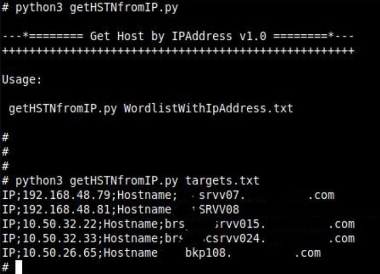

# getHSTNfromIP
Um script python simples para descobrir o hostname de um computador na rede em um ambiente AD pelo endereço de IP.

[](href="#")

## Installation   
```
$ sudo apt update
$ sudo apt install -y git python3
$ git clone https://github.com/Outs1d3r-Net/getHSTNfromIP.git /opt/getHSTNfromIP
$ cd /opt/getHSTNfromIP
$ python3 getHSTNfromIP.py --file ListIPs.txt
```

## Usage    
#### With custom wordlist:    
```
$ echo 192.168.0.{1..254} | tr ' ' '\n' >> ListIPs.txt
$ python3 getHSTNfromIP.py --file ListIPs.txt
```
#### With single IP:    
```
$ python3 getHSTNfromIP.py --single 127.0.1.1
```    
